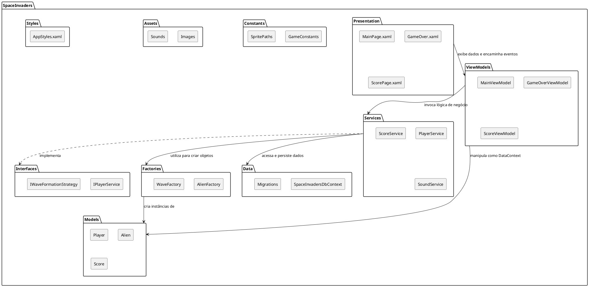

# Projeto Capstone: Recriação de Space Invaders

## 1. Visão Geral do Projeto

Este repositório contém o código-fonte e a documentação do projeto final da disciplina de Programação 3. O objetivo é recriar o clássico jogo **Space Invaders** como uma aplicação de desktop, utilizando C# e a Uno Platform, com foco na aplicação de conceitos de Programação Orientada a Objetos, Estruturas de Dados e manipulação de eventos.

## 2. Documentação Detalhada

A documentação do projeto é mantida em duas plataformas para garantir acesso fácil e abrangente a todas as informações relevantes:

- **[Documentação via Writerside](https://capstone-8f3123.gitlab.io/intro.html)**: A fonte principal para a documentação técnica, guias de usuário, e detalhes da arquitetura. É gerada automaticamente a partir dos arquivos no diretório `/Writerside`.

- **[Wiki do GitLab](https://gitlab.com/jala-university1/cohort-4/oficial-pt-programa-o-3-cspr-231.ga.t2.25.m1/se-o-a/gustavo.jesus/capstone/-/wikis/home)**: Utilizada para anotações de desenvolvimento.

## 3. Resumo dos Requisitos Funcionais Chave

| ID | Requisito | Prioridade |
| --- | --- | --- |
| RF01 | Controle da Nave (Movimento Horizontal) | Alta |
| RF02 | Disparo de Lasers (Vertical) | Alta |
| RF04 | Geração e Movimento de Inimigos | Alta |
| RF06 | Sistema de Vidas e Dano | Alta |
| RF07 | Condições de Fim de Jogo | Alta |
| RF19 | Menus e Telas (Inicial, Fim de Jogo) | Alta |
| RF21 | Persistência de Placares | Alta |

## 4. Tecnologias

*   **Linguagem**: C#
*   **Plataforma**: Uno Platform (para aplicação de desktop)
*   **UI**: XAML
*   **Persistência de Dados**: Entity Framework Core com PostgreSQL
*   **Padrão de Arquitetura**: MVVM (Model-View-ViewModel)
*   **Controle de Versão**: Git

## 5. Estrutura do Projeto

O projeto está organizado para seguir o padrão MVVM (Model-View-ViewModel), promovendo uma clara separação de responsabilidades. As principais pastas são:

*   **`SpaceInvaders/Models`**: Contém as classes de domínio, como `Player`, `Alien`, e `Score`.
*   **`SpaceInvaders/ViewModels`**: Responsável pela lógica de apresentação e pelo estado da UI. Ele interage com os serviços para obter e manipular os dados que serão exibidos nas Views.
*   **`SpaceInvaders/Services`**: Implementa a lógica de negócio desacoplada da UI, como `PlayerService` e `ScoreService`, e coordena o acesso aos dados.
*   **`SpaceInvaders/Presentation`**: Define a interface do usuário (UI) em XAML. Contém as `Views` (páginas como `MainPage.xaml` e `GameOver.xaml`) que se vinculam aos `ViewModels`.
*   **`SpaceInvaders/Data`**: Inclui o `DbContext` do Entity Framework Core e as migrações, gerenciando toda a comunicação com o banco de dados.
*   **`SpaceInvaders/Factories`**: Contém classes para a criação de objetos complexos, como `AlienFactory` e `WaveFactory`, abstraindo a lógica de instanciação.
*   **`SpaceInvaders/Interfaces`**: Define os contratos (abstrações) para os serviços e outras classes, permitindo a injeção de dependência e facilitando os testes.
*   **`SpaceInvaders/Constants`**: Armazena valores constantes usados em toda a aplicação, como caminhos de arquivos e configurações de jogo.
*   **`SpaceInvaders/Assets`**: Contém todos os recursos estáticos, como sprites, fontes e arquivos de som.
*   **`SpaceInvaders/Styles`**: Armazena dicionários de recursos XAML que definem os estilos visuais da aplicação.

## Diagrama de Estrutura do Projeto

Abaixo, um diagrama que ilustra a organização das principais pastas e a relação entre elas:

