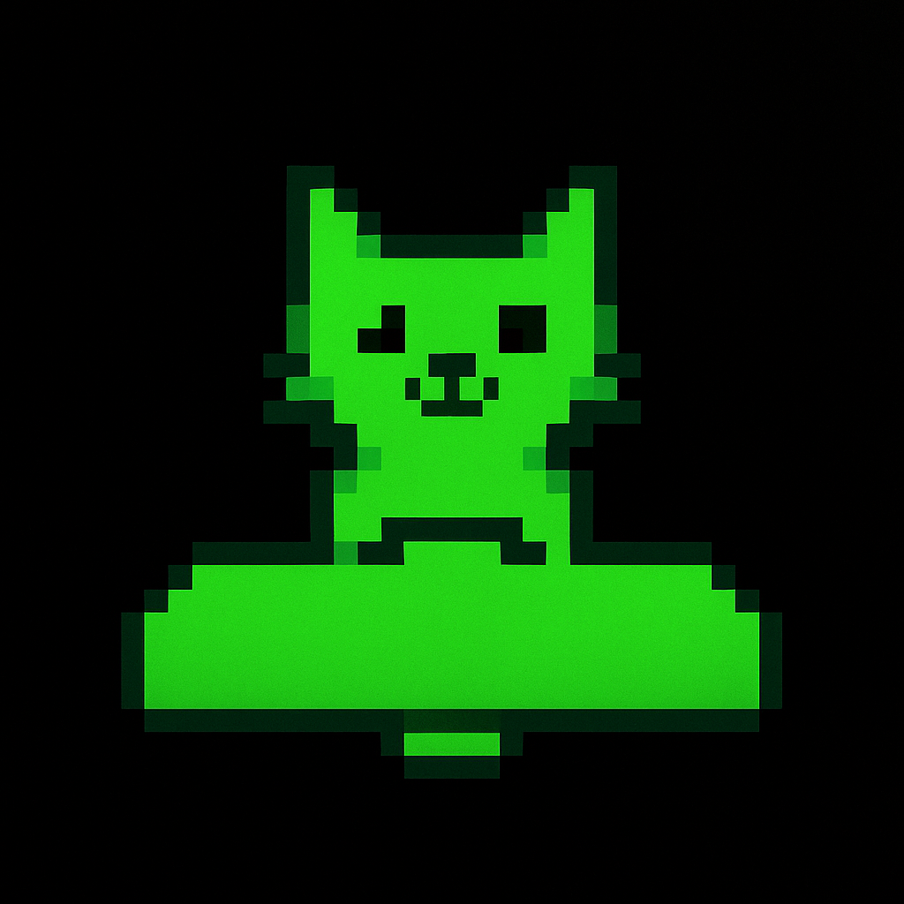

 # Catsteroids

## O Projeto

Este projeto é um jogo de tiro espacial inspirado no clássico Space Invaders, mas com um toque felino! Em Catsteroids, você controla uma nave-gato que deve defender seu planeta de uma horda de invasores alienígenas.

## Documentação

A documentação completa do projeto, incluindo detalhes de arquitetura, requisitos e o design do jogo, está disponível na nossa página do [Writerside](https://www.jetbrains.com/writerside/).

[Acesse a documentação aqui](./Writerside/hi.tree)

## Como Jogar

- **Movimento**: Use as setas do teclado para mover a nave para a esquerda e para a direita.
- **Tiro**: Pressione a barra de espaço para atirar nos inimigos.
- **Objetivo**: Destrua todos os invasores antes que eles cheguem à parte inferior da tela.

## Tecnologias

* **Linguagem**: [A ser definida]
* **Framework**: [A ser definido]

## Contribuição

Sinta-se à vontade para contribuir com o projeto! Abra uma issue ou envie um merge request com suas ideias.
