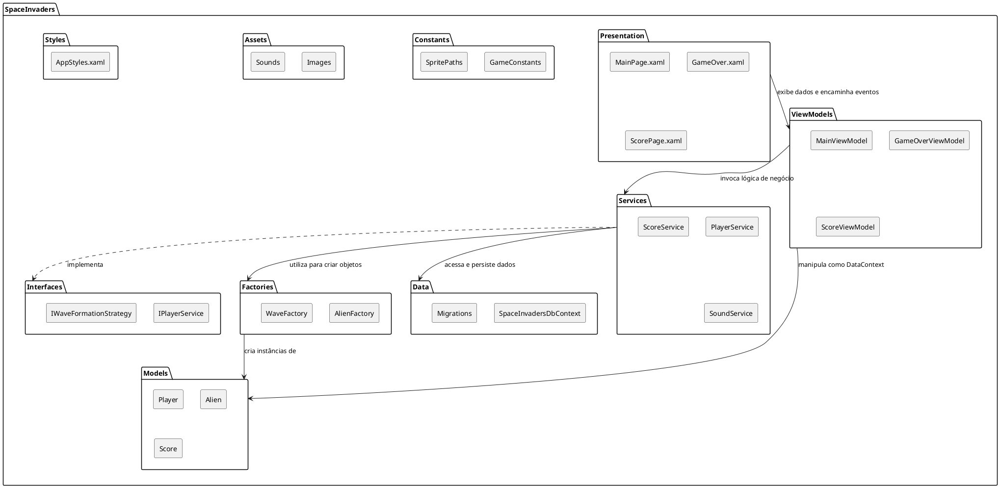

# Projeto Capstone: Recriação de Space Invaders

## Sumário

*   [1. Visão Geral do Projeto](#1-visão-geral-do-projeto)
*   [2. Documentação Detalhada](#2-documentação-detalhada)
*   [3. Resumo dos Requisitos Funcionais Chave](#3-resumo-dos-requisitos-funcionais-chave)
*   [4. Tecnologias](#4-tecnologias)
*   [5. Instalação e Execução](#5-instalação-e-execução)
    *   [5.1. Pré-requisitos](#51-pré-requisitos)
    *   [5.2. Configuração do Banco de Dados](#52-configuração-do-banco-de-dados)
        *   [5.2.1. Usando Docker Compose (Recomendado)](#521-usando-docker-compose-recomendado)
        *   [5.2.2. Configuração Manual do PostgreSQL](#522-configuração-manual-do-postgresql)
    *   [5.3. Aplicação das Migrações do Banco de Dados](#53-aplicação-das-migrações-do-banco-de-dados)
    *   [5.4. Execução do Projeto](#54-execução-do-projeto)
*   [6. Estrutura do Projeto](#6-estrutura-do-projeto)
*   [Diagrama de Estrutura do Projeto](#diagrama-de-estrutura-do-projeto)


## 1. Visão Geral do Projeto

Este repositório contém o código-fonte e a documentação do projeto final da disciplina de Programação 3. O objetivo é recriar o clássico jogo **Space Invaders** como uma aplicação de desktop, utilizando C# e a Uno Platform, com foco na aplicação de conceitos de Programação Orientada a Objetos, Estruturas de Dados e manipulação de eventos.

## 2. Documentação Detalhada

A documentação do projeto é mantida em duas plataformas para garantir acesso fácil e abrangente a todas as informações relevantes:

- **[Documentação via Writerside](https://capstone-8f3123.gitlab.io/intro.html)**: A fonte principal para a documentação técnica, guias de usuário, e detalhes da arquitetura. É gerada automaticamente a partir dos arquivos no diretório `/Writerside`.

- **[Wiki do GitLab](https://gitlab.com/jala-university1/cohort-4/oficial-pt-programa-o-3-cspr-231.ga.t2.25.m1/se-o-a/gustavo.jesus/capstone/-/wikis/home)**: Utilizada para anotações de desenvolvimento.


## 3. Resumo dos Requisitos Funcionais Chave

| ID | Requisito | Prioridade |
| --- | --- | --- |
| RF01 | Controle da Nave (Movimento Horizontal) | Alta |
| RF02 | Disparo de Lasers (Vertical) | Alta |
| RF04 | Geração e Movimento de Inimigos | Alta |
| RF06 | Sistema de Vidas e Dano | Alta |
| RF07 | Condições de Fim de Jogo | Alta |
| RF19 | Menus e Telas (Inicial, Fim de Jogo) | Alta |
| RF21 | Persistência de Placares | Alta |

## 4. Tecnologias

*   **Linguagem**: C#
*   **Plataforma**: Uno Platform (para aplicação de desktop)
*   **UI**: XAML
*   **Persistência de Dados**: Entity Framework Core com PostgreSQL
*   **Padrão de Arquitetura**: MVVM (Model-View-ViewModel)
*   **Controle de Versão**: Git

## 5. Instalação e Execução

Este guia detalha os passos necessários para configurar o ambiente de desenvolvimento, instalar as dependências e executar o projeto Space Invaders.

### 5.1. Pré-requisitos

Certifique-se de que os seguintes softwares estejam instalados em sua máquina:

*   **SDK do .NET 9.0 (ou superior)**: Essencial para compilar e executar aplicações .NET. Você pode baixá-lo em [dotnet.microsoft.com/download](https://dotnet.microsoft.com/download).
*   **Docker Desktop (ou Docker Engine)**: Necessário para rodar o banco de dados PostgreSQL. Disponível em [docker.com/products/docker-desktop](https://www.docker.com/products/docker-desktop).
*   **Visual Studio 2022 (ou Visual Studio Code ou Rider)**: IDEs recomendadas para desenvolvimento C# e Uno Platform. Embora não sejam estritamente obrigatórias, facilitam muito o processo.
    *   **Visual Studio**: Certifique-se de ter as cargas de trabalho "Desenvolvimento para desktop com .NET" e "Desenvolvimento multiplataforma de interface do usuário .NET" instaladas.
*   **Templates do Uno Platform**: Para criar e gerenciar projetos Uno Platform, você precisará instalar os templates. Execute o seguinte comando no terminal:

    ```c#
    dotnet new install Uno.Templates
    ```

    Para mais detalhes, consulte a documentação oficial: [platform.uno/docs/articles/get-started.html](https://platform.uno/docs/articles/get-started.html)

### 5.2. Configuração do Banco de Dados (PostgreSQL com Docker)

O projeto utiliza PostgreSQL para persistência de dados (placares), gerenciado via Docker para simplificar a configuração.

1.  **Navegue até o diretório raiz do projeto** no seu terminal (onde o arquivo `docker-compose.yml` está localizado):

2.  **Inicie o serviço do banco de dados** usando Docker Compose:

    ```c#
    docker-compose up -d db
    ```

    Este comando irá baixar a imagem do PostgreSQL (se ainda não tiver), criar e iniciar um contêiner de banco de dados configurado para o projeto. O banco de dados estará acessível na porta `5432`.

3.  **Verifique se o contêiner está rodando** (opcional):

    ```c#
    docker ps
    ```

    Você deverá ver um contêiner chamado `capstone-programming-3-db-1` (ou similar) na lista.

### 5.3. Configuração e Compilação do Projeto

1.  **Navegue até o diretório do projeto SpaceInvaders**:

    ```c#
    cd SpaceInvaders/SpaceInvaders
    ```

2.  **Restaure as dependências do projeto**:

    ```c#
    dotnet restore
    ```

3.  **Compile o projeto**:

    ```c#
    dotnet build
    ```

    Este comando irá compilar o código-fonte e verificar se há erros.

### 5.4. Execução do Projeto

Após a compilação bem-sucedida e com o banco de dados rodando, você pode executar a aplicação.

1.  **Execute a aplicação desktop**:

    ```c#
    dotnet run --project SpaceInvaders/SpaceInvaders.csproj -f net9.0-desktop
    ```

    A aplicação Space Invaders deverá ser iniciada em uma nova janela.

#### Nota sobre Áudio no Linux

Se você estiver executando o projeto em um ambiente Linux, certifique-se de ter o `mpg123` instalado para a reprodução de áudio. O `SoundService` do projeto utiliza este utilitário externo para garantir a compatibilidade de áudio no Linux.

Para instalar o `mpg123` (exemplo para sistemas baseados em Debian/Ubuntu):

```c#
sudo apt-get update
sudo apt-get install mpg123
```

Com esses passos, você estará pronto para desenvolver e testar o projeto Space Invaders em sua máquina.

## 6. Estrutura do Projeto

O projeto está organizado para seguir o padrão MVVM (Model-View-ViewModel), promovendo uma clara separação de responsabilidades. As principais pastas são:

*   **`SpaceInvaders/Models`**: Contém as classes de domínio, como `Player`, `Alien`, e `Score`.
*   **`SpaceInvaders/ViewModels`**: Responsável pela lógica de apresentação e pelo estado da UI. Ele interage com os serviços para obter e manipular os dados que serão exibidos nas Views.
*   **`SpaceInvaders/Services`**: Implementa a lógica de negócio desacoplada da UI, como `PlayerService` e `ScoreService`, e coordena o acesso aos dados.
*   **`SpaceInvaders/Presentation`**: Define a interface do usuário (UI) em XAML. Contém as `Views` (páginas como `MainPage.xaml` e `GameOver.xaml`) que se vinculam aos `ViewModels`.
*   **`SpaceInvaders/Data`**: Inclui o `DbContext` do Entity Framework Core e as migrações, gerenciando toda a comunicação com o banco de dados.
*   **`SpaceInvaders/Factories`**: Contém classes para a criação de objetos complexos, como `AlienFactory` e `WaveFactory`, abstraindo a lógica de instanciação.
*   **`SpaceInvaders/Interfaces`**: Define os contratos (abstrações) para os serviços e outras classes, permitindo a injeção de dependência e facilitando os testes.
*   **`SpaceInvaders/Constants`**: Armazena valores constantes usados em toda a aplicação, como caminhos de arquivos e configurações de jogo.
*   **`SpaceInvaders/Assets`**: Contém todos os recursos estáticos, como sprites, fontes e arquivos de som.
*   **`SpaceInvaders/Styles`**: Armazena dicionários de recursos XAML que definem os estilos visuais da aplicação.

## Diagrama de Estrutura do Projeto

Abaixo, um diagrama que ilustra a organização das principais pastas e a relação entre elas:


