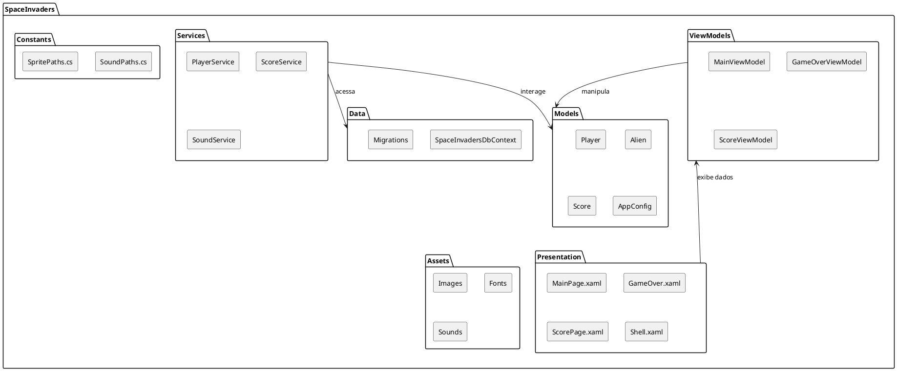

# Diagramas UML

Os Diagramas de Linguagem de Modelagem Unificada (UML) são ferramentas essenciais para visualizar, especificar, construir e documentar os artefatos de um sistema de software. Eles fornecem uma representação gráfica da estrutura e do comportamento do sistema, facilitando a compreensão e a comunicação entre os membros da equipe.

## 1. Diagrama de Estrutura do Projeto (PlantUML)

Este diagrama ilustra a organização das principais pastas do projeto Space Invaders e a relação entre elas, oferecendo uma visão de alto nível da arquitetura do código.

## 2. Outros Diagramas UML Relevantes (Potenciais)

Para uma documentação mais aprofundada, outros tipos de diagramas UML poderiam ser desenvolvidos:

*   **Diagrama de Classes**: Para detalhar as classes do sistema, seus atributos, métodos e relacionamentos (herança, associação, agregação, composição).
*   **Diagrama de Sequência**: Para modelar a interação entre objetos em uma sequência temporal, mostrando a ordem das chamadas de métodos.
*   **Diagrama de Casos de Uso**: Para descrever as funcionalidades do sistema do ponto de vista do usuário, mostrando como os atores interagem com o sistema.
*   **Diagrama de Atividades**: Para representar o fluxo de trabalho ou o processo de negócio, mostrando as etapas e as decisões envolvidas.
*   **Diagrama de Componentes**: Para ilustrar a estrutura dos componentes de software e suas dependências.
