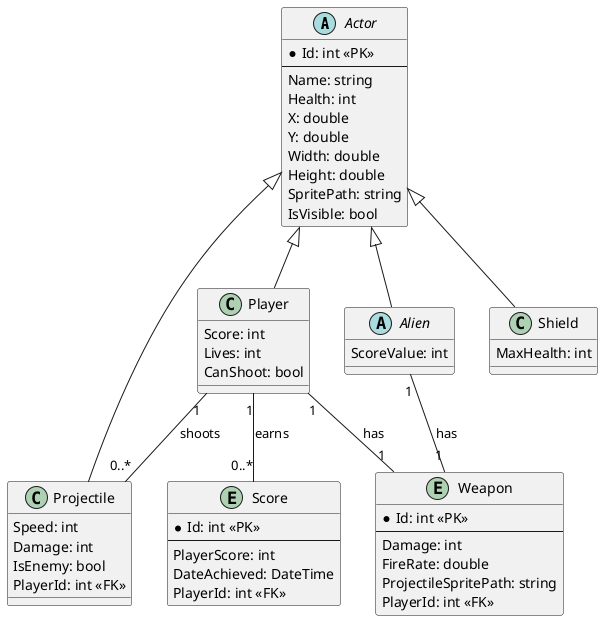

# Modelo de Dados

O modelo de dados define a estrutura das informações que são gerenciadas e persistidas pelo sistema. No projeto Space Invaders, o foco principal da persistência de dados está nos placares dos jogadores.

## 1. Entidades Principais

As principais entidades que compõem o modelo de dados são representadas pelas classes `DbSet` no `SpaceInvadersDbContext`:

*   **`Player`**: Representa o jogador principal, suas características e relacionamentos com outros dados.
*   **`Alien`**: Classe base abstrata para os diferentes tipos de alienígenas no jogo. As implementações concretas (`AlienType1`, `AlienType2`, etc.) herdam desta classe.
*   **`Projectile`**: Representa os projéteis disparados por jogadores ou alienígenas.
*   **`Shield`**: Representa as barreiras de proteção no jogo.
*   **`Weapon`**: Define as características das armas, como dano e taxa de disparo.
*   **`Score`**: Representa a pontuação de um jogador em uma partida. Esta entidade armazena informações como:
    *   `Id` (chave primária)
    *   `PlayerScore` (pontuação alcançada)
    *   `DateAchieved` (data em que a pontuação foi alcançada)
    *   `PlayerId` (chave estrangeira para o jogador associado, pode ser nula)

As classes C# que representam essas entidades estão localizadas na pasta `SpaceInvaders/Models`.

## 2. Mecanismo de Persistência

O projeto utiliza **Entity Framework Core** como ORM (Object-Relational Mapper) para interagir com o banco de dados **PostgreSQL**. Essa combinação oferece uma solução robusta e flexível para o gerenciamento de dados.

*   **`SpaceInvadersDbContext`**: Esta classe, localizada na pasta `SpaceInvaders/Data`, é o contexto do banco de dados. Ela atua como uma ponte entre as entidades do modelo e o banco de dados, permitindo operações de consulta, inserção, atualização e exclusão. A configuração da conexão com o banco de dados é feita através do `appsettings.json`, utilizando o provedor `Npgsql` para PostgreSQL.

*   **Migrações (Migrations)**: O Entity Framework Core utiliza migrações para gerenciar as alterações no esquema do banco de dados. As migrações são arquivos de código que descrevem como o esquema do banco de dados deve ser atualizado para refletir as mudanças no modelo de dados da aplicação. Elas estão localizadas na pasta `SpaceInvaders/Migrations`.

## 3. Diagrama de Entidade-Relacionamento (ERD)

Este diagrama ilustra as entidades principais do modelo de dados e seus relacionamentos:



## 4. Estrutura do Banco de Dados (Simplificada)

O banco de dados PostgreSQL conterá uma tabela principal para armazenar as pontuações, refletindo a estrutura da entidade `Score`.

```sql
CREATE TABLE "Scores" (
    "Id" INTEGER GENERATED BY DEFAULT AS IDENTITY,
    "PlayerScore" INTEGER NOT NULL,
    "DateAchieved" TIMESTAMP WITH TIME ZONE NOT NULL,
    "PlayerId" INTEGER,
    CONSTRAINT "PK_Scores" PRIMARY KEY ("Id"),
    CONSTRAINT "FK_Scores_Players_PlayerId" FOREIGN KEY ("PlayerId") REFERENCES "Players" ("Id")
);
```

Este modelo de dados simplificado é suficiente para atender aos requisitos de persistência de placares do projeto Space Invaders.