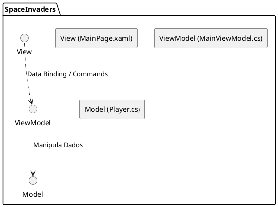
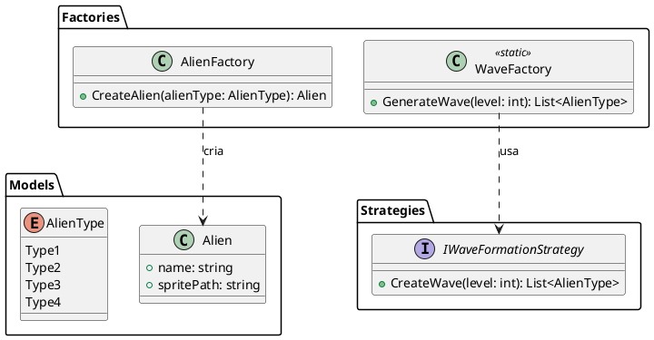
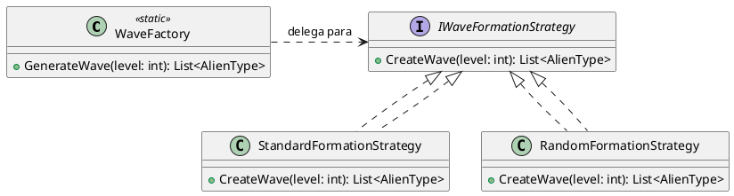
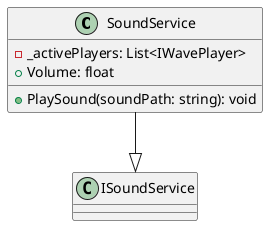
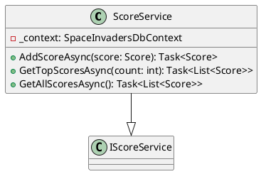

# Padrões de Design

Este documento descreve os principais padrões de design utilizados no desenvolvimento do projeto Space Invaders. A aplicação de padrões de design visa promover a modularidade, a manutenibilidade, a escalabilidade e a testabilidade do código.

## 1. Model-View-ViewModel (MVVM)

O padrão MVVM é amplamente utilizado em aplicações com interfaces de usuário ricas, como as desenvolvidas com XAML e Uno Platform. Ele separa a lógica de negócio e a interface do usuário em três componentes distintos:

*   **Model**: Representa os dados e a lógica de negócio. No projeto Space Invaders, as classes dentro da pasta `SpaceInvaders/Models` (como `Player`, `Alien`, `Score`) atuam como Models.

*   **View**: É a interface do usuário, responsável por exibir os dados e capturar as interações do usuário. No projeto, os arquivos XAML na pasta `SpaceInvaders/Presentation` (como `MainPage.xaml`, `GameOver.xaml`) são as Views.

*   **ViewModel**: Atua como uma camada intermediária entre o Model e a View. Ele expõe os dados do Model de forma que a View possa facilmente se ligar a eles (data binding) e contém a lógica de apresentação e comandos que respondem às interações do usuário. As classes na pasta `SpaceInvaders/ViewModels` (como `MainViewModel`, `GameOverViewModel`) são os ViewModels.

### Aplicação no Projeto Space Invaders: {id="aplica-o-no-projeto-space-invaders_1"}

O MVVM é fundamental para a organização do projeto, permitindo:

*   **Separação de Responsabilidades**: A lógica da UI é separada da lógica de negócio, facilitando a manutenção e o desenvolvimento paralelo.
*   **Testabilidade**: Os ViewModels podem ser testados independentemente da UI, o que melhora a qualidade do código.
*   **Reutilização de Código**: A lógica de negócio nos Models e ViewModels pode ser reutilizada em diferentes Views ou plataformas.

### Diagrama MVVM

## 2. Padrão Factory

O padrão Factory é utilizado para encapsular a lógica de criação de objetos, permitindo que o sistema seja mais flexível e desacoplado. No projeto, ele se manifesta de duas formas principais: `AlienFactory` e `WaveFactory`.

*   **AlienFactory**: Responsável por criar instâncias de diferentes tipos de alienígenas (`AlienType1`, `AlienType2`, etc.). Ela abstrai o processo de instanciação, de modo que o resto da aplicação não precisa conhecer os detalhes de como cada tipo de alienígena é construído.

*   **WaveFactory**: Uma fábrica estática que gera ondas de alienígenas (`List<AlienType>`) com base no nível do jogo. O diferencial desta fábrica é que ela colabora com o **Padrão Strategy** para delegar o algoritmo de formação da onda.

### Diagrama do Padrão Factory

## 3. Padrão Strategy

O padrão Strategy permite definir uma família de algoritmos, encapsular cada um deles e torná-los intercambiáveis. Isso permite que o algoritmo varie independentemente dos clientes que o utilizam.

No projeto Space Invaders, o padrão Strategy é utilizado pela `WaveFactory` para determinar como uma onda de alienígenas será formada. Dependendo do nível do jogo, a `WaveFactory` seleciona uma estratégia diferente:

*   **StandardFormationStrategy**: Cria uma onda com uma formação predefinida e que progride de forma linear com o nível.
*   **RandomFormationStrategy**: Cria uma onda com uma formação aleatória, tornando o jogo menos previsível.

Essa abordagem permite adicionar novas estratégias de formação de ondas no futuro (por exemplo, uma `BossFormationStrategy`) sem modificar a `WaveFactory`, apenas criando uma nova classe que implemente a interface `IWaveFormationStrategy`.

### Aplicação no Projeto Space Invaders:

*   **Flexibilidade**: A `WaveFactory` pode alternar entre as estratégias em tempo de execução.
*   **Extensibilidade**: Novas estratégias podem ser adicionadas facilmente.
*   **Separação de Responsabilidades**: A lógica de criação da onda (`WaveFactory`) é separada da lógica de como a onda é formada (as estratégias).

### Diagrama do Padrão Strategy

## 4. Singleton (Implícito)

O padrão Singleton pode ser observado implicitamente em serviços que precisam ter uma única instância global acessível em toda a aplicação, como o `SoundService` ou `ScoreService`. Embora não haja uma implementação estrita de Singleton com construtores privados e propriedades estáticas, a injeção de dependência (se utilizada) ou a forma como esses serviços são instanciados e acessados pode resultar em um comportamento de instância única.

### Diagrama Singleton (SoundService)

### Diagrama Singleton (ScoreService)

