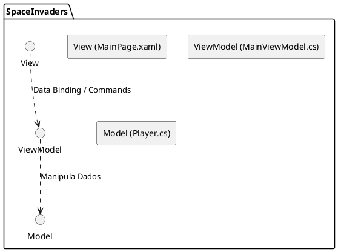
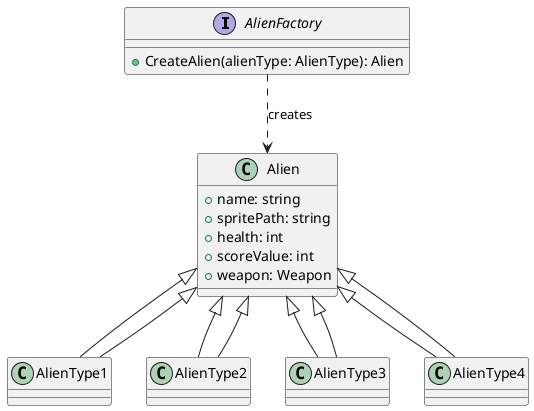
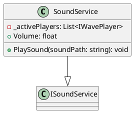
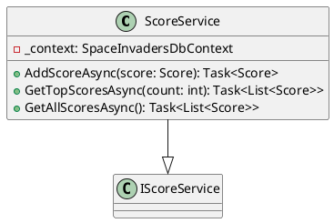

# Padrões de Design

Este documento descreve os principais padrões de design utilizados no desenvolvimento do projeto Space Invaders. A aplicação de padrões de design visa promover a modularidade, a manutenibilidade, a escalabilidade e a testabilidade do código.

## 1. Model-View-ViewModel (MVVM)

O padrão MVVM é amplamente utilizado em aplicações com interfaces de usuário ricas, como as desenvolvidas com XAML e Uno Platform. Ele separa a lógica de negócio e a interface do usuário em três componentes distintos:

*   **Model**: Representa os dados e a lógica de negócio. No projeto Space Invaders, as classes dentro da pasta `SpaceInvaders/Models` (como `Player`, `Alien`, `Score`) atuam como Models.

*   **View**: É a interface do usuário, responsável por exibir os dados e capturar as interações do usuário. No projeto, os arquivos XAML na pasta `SpaceInvaders/Presentation` (como `MainPage.xaml`, `GameOver.xaml`) são as Views.

*   **ViewModel**: Atua como uma camada intermediária entre o Model e a View. Ele expõe os dados do Model de forma que a View possa facilmente se ligar a eles (data binding) e contém a lógica de apresentação e comandos que respondem às interações do usuário. As classes na pasta `SpaceInvaders/ViewModels` (como `MainViewModel`, `GameOverViewModel`) são os ViewModels.

### Aplicação no Projeto Space Invaders:

O MVVM é fundamental para a organização do projeto, permitindo:

*   **Separação de Responsabilidades**: A lógica da UI é separada da lógica de negócio, facilitando a manutenção e o desenvolvimento paralelo.
*   **Testabilidade**: Os ViewModels podem ser testados independentemente da UI, o que melhora a qualidade do código.
*   **Reutilização de Código**: A lógica de negócio nos Models e ViewModels pode ser reutilizada em diferentes Views ou plataformas.

### Diagrama MVVM

## 2. Factory Method (Implícito)

Embora não explicitamente nomeado como um padrão Factory Method em uma classe dedicada, a criação de diferentes tipos de alienígenas (AlienType1, AlienType2, etc.) pode ser vista como uma aplicação implícita deste padrão. A `AlienFactory.cs` na pasta `SpaceInvaders/Factories` é um exemplo claro de como diferentes objetos (aliens) são criados com base em um tipo, abstraindo o processo de instanciação.

### Diagrama Factory Method

## 3. Singleton (Implícito)

O padrão Singleton pode ser observado implicitamente em serviços que precisam ter uma única instância global acessível em toda a aplicação, como o `SoundService` ou `ScoreService`. Embora não haja uma implementação estrita de Singleton com construtores privados e propriedades estáticas, a injeção de dependência (se utilizada) ou a forma como esses serviços são instanciados e acessados pode resultar em um comportamento de instância única.

### Diagrama Singleton (SoundService)

### Diagrama Singleton (ScoreService)

