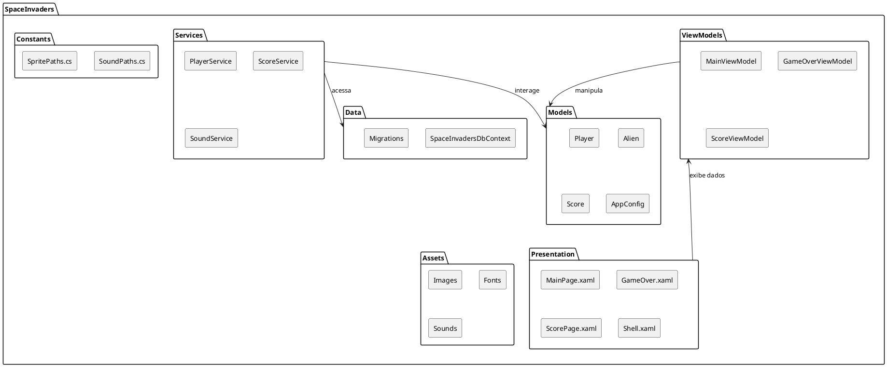

# Visão Geral do Projeto

Este documento oferece uma visão abrangente do projeto de recriação do clássico jogo **Space Invaders**. Desenvolvido como parte da disciplina de Programação 3, o projeto foca na aplicação prática de conceitos de Programação Orientada a Objetos (OOP), Estruturas de Dados e manipulação de eventos em C#.

## 1. Objetivo e Escopo

O principal objetivo é desenvolver uma aplicação de desktop funcional que recrie a experiência do Space Invaders original. O projeto é um esforço individual, construindo a interface e a lógica do jogo do zero, sem o auxílio de um motor de jogo externo (game engine). As entregas são divididas em fases parciais e uma entrega final, abrangendo todos os requisitos funcionais e não-funcionais.

## 2. Tecnologias Utilizadas

O projeto é construído sobre uma pilha de tecnologias modernas e robustas, garantindo portabilidade e desempenho:

*   **Linguagem de Programação**: C#
*   **Plataforma**: Uno Platform (para desenvolvimento de aplicações desktop multiplataforma)
*   **Interface de Usuário (UI)**: XAML
*   **Persistência de Dados**: Entity Framework Core com PostgreSQL (para gerenciamento de placares)
*   **Padrão de Arquitetura**: MVVM (Model-View-ViewModel)
*   **Áudio**: NAudio (para manipulação de efeitos sonoros.
*   **SCM**: GitLab


> **Nota**: Em ambientes Linux, a reprodução de áudio é gerenciada através de um processo externo que invoca o `mpg123`, garantindo a compatibilidade com o sistema operacional.)
> {style="note"}


## 3. Principais Funcionalidades

O jogo implementa as seguintes funcionalidades chave:

*   **Controle da Nave**: Movimento horizontal do jogador e disparo de lasers.
*   **Inimigos (Alienígenas)**: Múltiplas ondas de alienígenas com movimento em bloco, descida progressiva e aumento de velocidade/frequência de disparo. Inclui alienígenas especiais com pontuação variável.
*   **Barreiras de Proteção**: Escudos destrutíveis que bloqueiam tiros.
*   **Sistema de Pontuação e Vidas**: Gerenciamento de pontuações por tipo de alienígena e controle de vidas do jogador.
*   **Fim de Jogo**: Condições claras para o término do jogo (perda de todas as vidas ou alienígenas atingindo a base).
*   **Persistência de Dados**: Salvamento de placares (pontuação e apelido) em um arquivo de texto.
*   **Interface do Usuário**: Telas iniciais, de jogo, de fim de jogo e de placares.
*   **Efeitos Sonoros**: Sons para ações significativas do jogo.

## 4. Estrutura do Projeto

O projeto segue uma estrutura organizada para facilitar o desenvolvimento e a manutenção:

*   **`SpaceInvaders/Models`**: Define as entidades de dados do jogo (ex: `Player`, `Alien`, `Score`).
*   **`SpaceInvaders/ViewModels`**: Contém a lógica de apresentação e a interação entre a UI e os modelos.
*   **`SpaceInvaders/Services`**: Implementa a lógica de negócio e a interação com o banco de dados e outros serviços (ex: `PlayerService`, `ScoreService`, `SoundService`).
*   **`SpaceInvaders/Data`**: Gerencia o contexto do banco de dados e as migrações do Entity Framework Core.
*   **`SpaceInvaders/Presentation`**: Contém os arquivos XAML que definem a interface do usuário.
*   **`SpaceInvaders/Constants`**: Armazena constantes globais, como caminhos para assets.
*   **`SpaceInvaders/Assets`**: Inclui todos os recursos visuais (sprites, backgrounds) e sonoros (músicas, efeitos) do jogo.

### Diagrama de Estrutura do Projeto

Abaixo, um diagrama que ilustra a organização das principais pastas e a relação entre elas:



## 5. Fases do Projeto

O desenvolvimento foi dividido em fases:

*   **Entrega Intermediária (Midterm)**: Foco em um subconjunto de requisitos funcionais, incluindo movimento e disparo do jogador, alienígenas estáticos, escudos destrutíveis, atualização de pontuação em memória, tela inicial e sons básicos.
*   **Entrega Final**: Implementação de todos os requisitos funcionais e não-funcionais, incluindo movimento complexo dos alienígenas, persistência de placares e todas as telas e mecânicas detalhadas.

## 6. Ambiente de Desenvolvimento com Docker

Para facilitar a configuração do ambiente de desenvolvimento, especialmente para o banco de dados PostgreSQL, o projeto utiliza Docker. O arquivo `docker-compose.yml` define um serviço de banco de dados que pode ser facilmente inicializado:

```yaml
version: '3.8'

services:
  db:
    image: postgres:16-alpine
    restart: always
    environment:
      POSTGRES_DB: spaceinvaders_db
      POSTGRES_USER: user
      POSTGRES_PASSWORD: password
    ports:
      - "5432:5432"
    volumes:
      - db_data:/var/lib/postgresql/data

volumes:
  db_data:
```

Para iniciar o banco de dados, basta executar o comando `docker-compose up -d db` ou `docker-compose up -d db` no diretório raiz do projeto. Isso garantirá que o banco de dados PostgreSQL esteja disponível e configurado para o desenvolvimento e testes.
