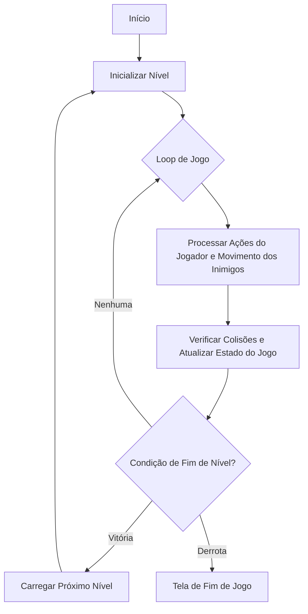

# Space Invaders

## O que é o jogo?

Space Invaders é um jogo eletrônico arcade que se tornou um marco na história dos videogames, revolucionando a indústria do entretenimento digital no final dos anos 1970. Criado pela empresa japonesa Taito em 1978 e projetado por Tomohiro Nishikado, o jogo rapidamente se transformou em um fenômeno global que definiria muitos elementos fundamentais dos jogos de nave e shoot 'em up.

## Conceito do Jogo

No jogo, o jogador controla uma nave de defesa terrestre posicionada na parte inferior da tela, movendo-se horizontalmente e disparando contra ondas de invasores alienígenas que descem gradualmente em direção à Terra. O objetivo é simples, porém desafiador: destruir todos os invasores antes que eles alcancem a superfície do planeta.

### Características Principais:

- **Jogabilidade Simples**: Movimento lateral e tiros verticais
- **Progressão de Dificuldade**: Invasores ficam mais rápidos conforme são eliminados
- **Elementos Gráficos Básicos**: Sprites pixelados que se tornaram um ícone da era dos videogames retrô
- **Mecânica de Defesa**: Uso de "barricadas" que protegem temporariamente a nave do jogador

## Explicação Detalhada do Jogo

**Objetivo Principal:** O jogador deve destruir todas as naves alienígenas que formam uma falange na parte superior da tela antes que elas consigam descer e alcançar a parte inferior, onde a nave do jogador está posicionada.

**Mecânicas de Jogo:**

1.  **Controle do Jogador:**
    *   O jogador controla um canhão laser (nave) que só pode se mover para a esquerda e para a direita na parte inferior da tela.
    *   O disparo é sempre vertical, para cima. Só pode haver um tiro do jogador na tela por vez.

2.  **Comportamento dos Invasores:**
    *   Os alienígenas se movem em bloco, horizontalmente. Quando um alienígena na borda da formação atinge o limite da tela, todo o bloco desce um nível e inverte a direção do movimento.
    *   À medida que o jogador destrói os invasores, a velocidade de movimento e a frequência dos disparos dos alienígenas restantes aumentam. Isso acontece porque, originalmente, o hardware tinha dificuldade para processar muitos sprites, e com menos inimigos na tela, o jogo rodava mais rápido. Este "bug" se tornou uma característica fundamental da jogabilidade.
    *   Ocasionalmente, uma nave especial (um "disco voador") cruza o topo da tela, oferecendo mais pontos se for destruída.

3.  **Sistema de Defesa (Barricadas):**
    *   Existem quatro barricadas posicionadas acima da nave do jogador.
    *   Elas servem como escudos, absorvendo tiros tanto dos inimigos quanto do próprio jogador.
    *   Cada tiro destrói uma pequena parte da barricada, que vai se deteriorando até desaparecer completamente.

**Condições de Fim de Jogo:**

*   **Vitória (Nível):** O jogador vence o nível ao destruir todos os invasores da onda. O jogo então avança para o próximo nível, geralmente com os inimigos começando em uma posição mais baixa.
*   **Derrota:** O jogo termina se:
    1.  Os invasores conseguirem alcançar a parte inferior da tela.
    2.  A nave do jogador for destruída por um tiro inimigo e não houver mais vidas restantes.

## Fluxograma do Jogo

## Impacto Cultural

Space Invaders não foi apenas um jogo, mas um fenômeno cultural que:

- Popularizou os jogos arcade
- Inspirou gerações de desenvolvedores de jogos
- Criou um novo gênero de jogos de nave e tiro
- Ajudou a estabelecer o Japão como potência na indústria de jogos eletrônicos

### Curiosidades:

1. O jogo foi tão popular no Japão que causou uma "escassez de moedas" nas máquinas arcade
2. Inspirou diversos jogos e franquias posteriores
3. Seus gráficos pixelados se tornaram um símbolo da cultura pop dos anos 80

Space Invaders representa mais do que um simples jogo: é um marco tecnológico que ajudou a definir a cultura dos videogames como a conhecemos hoje.

**Links sobre o jogo em ação:**
- [Space Invaders 1978 - Arcade Gameplay](https://www.youtube.com/watch?v=MU4psw3ccUI)
- [Space Invaders Creator Thinks Video Games Are Made The Wrong Way](https://www.youtube.com/watch?v=M7cQoRXjPEY)
- [How Space Invaders Birthed Japanese Games](https://www.youtube.com/watch?v=Jbn8IRmSq8M)

> Jogue online:  [Versão online](https://freeinvaders.org/)
> {style="note"}

