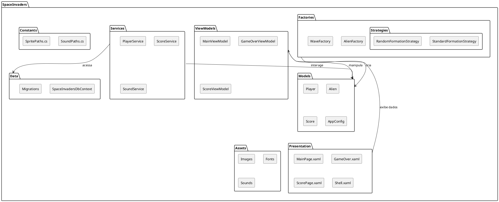
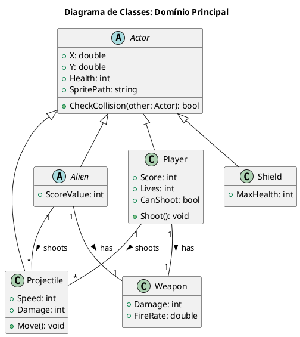
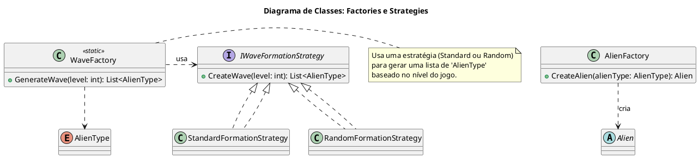
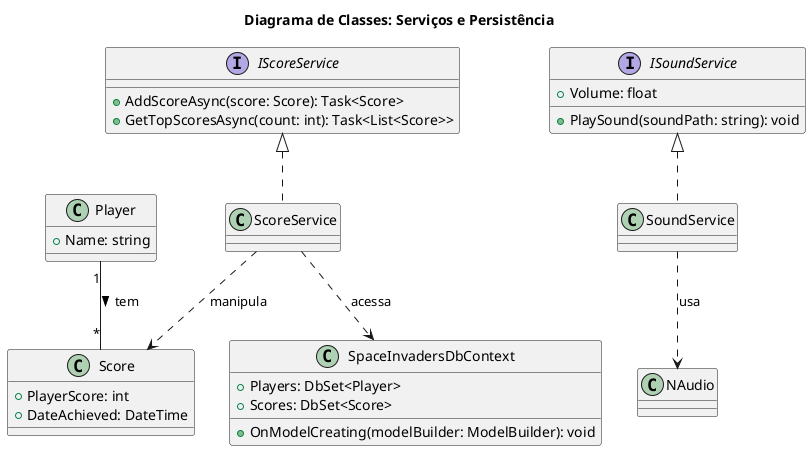
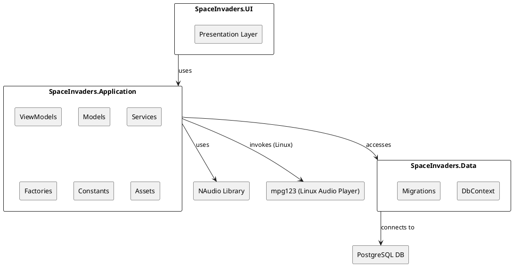
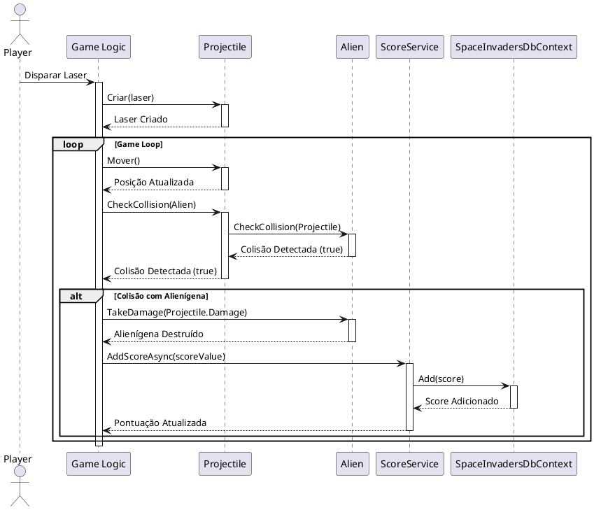
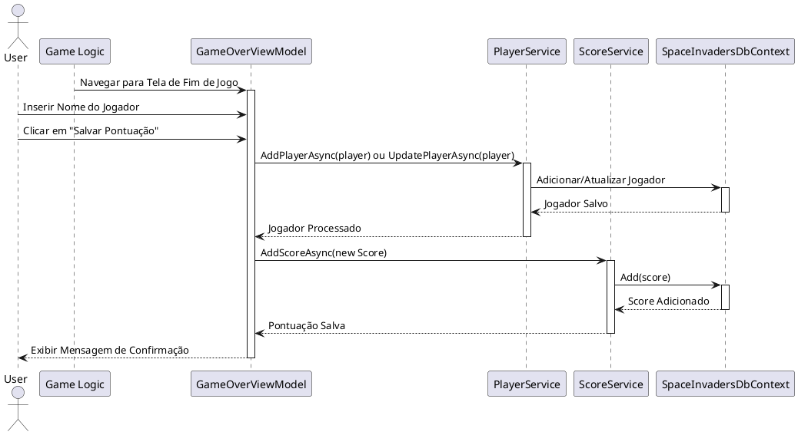
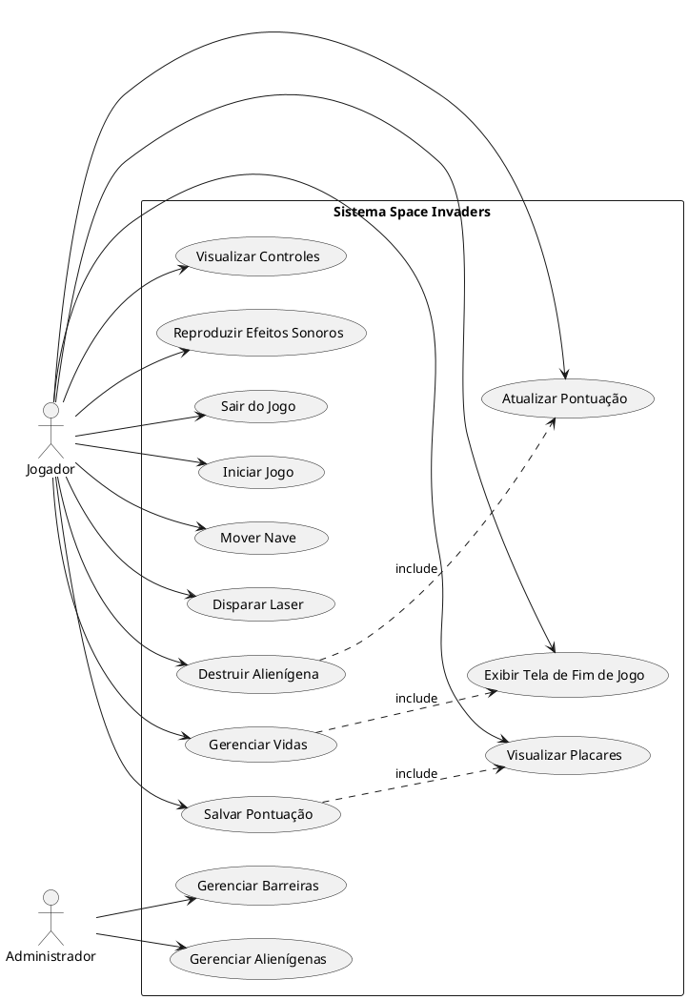
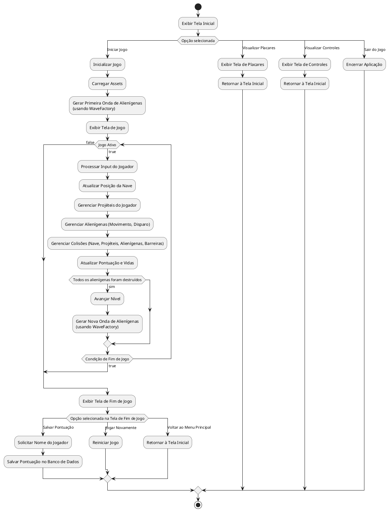

# Diagramas UML

Os Diagramas de Linguagem de Modelagem Unificada (UML) são ferramentas essenciais para visualizar, especificar, construir e documentar os artefatos de um sistema de software. Eles fornecem uma representação gráfica da estrutura e do comportamento do sistema, facilitando a compreensão e a comunicação entre os membros da equipe.

## 1. Diagramas Estruturais

Os diagramas estruturais focam na visualização da estrutura estática do sistema, seus componentes e como eles se relacionam.

### 1.1. Diagrama de Estrutura do Projeto

Este diagrama ilustra a organização das principais pastas do projeto Space Invaders e a relação entre elas, oferecendo uma visão de alto nível da arquitetura do código.

### 1.2. Diagrama de Classes: Domínio Principal

Este diagrama detalha as classes centrais da jogabilidade, seus atributos e relacionamentos, fornecendo uma visão estrutural do modelo de domínio do jogo.

### 1.3. Diagrama de Classes: Factories e Strategies

Este diagrama foca em como os objetos do jogo são criados, ilustrando o uso dos padrões de design Factory e Strategy.

### 1.4. Diagrama de Classes: Serviços e Persistência

Este diagrama ilustra como os serviços da aplicação interagem com a camada de persistência de dados e outros serviços externos.

### 1.5. Diagrama de Componentes

Este diagrama ilustra a estrutura dos componentes de software do projeto e suas dependências, fornecendo uma visão de alto nível de como as diferentes partes do sistema se interligam.

## 2. Diagramas Comportamentais

Os diagramas comportamentais focam na visualização da dinâmica do sistema, mostrando como os objetos interagem e como o sistema responde a eventos.

### 2.1. Diagrama de Sequência: Jogador Atira em Alienígena e Pontuação é Atualizada

Este diagrama ilustra a sequência de interações quando o jogador dispara um projétil que atinge um alienígena, resultando na atualização da pontuação.

### 2.2. Diagrama de Sequência: Fim de Jogo e Salvamento de Pontuação

Este diagrama ilustra a sequência de interações que ocorrem quando o jogo termina e o jogador opta por salvar sua pontuação.

### 2.3. Diagrama de Casos de Uso

Este diagrama descreve as funcionalidades do sistema do ponto de vista do usuário, mostrando como os atores interagem com o sistema.

### 2.4. Diagrama de Atividades: Fluxo Principal do Jogo

Este diagrama representa o fluxo principal de atividades do jogo, desde o início da partida até o seu término.

